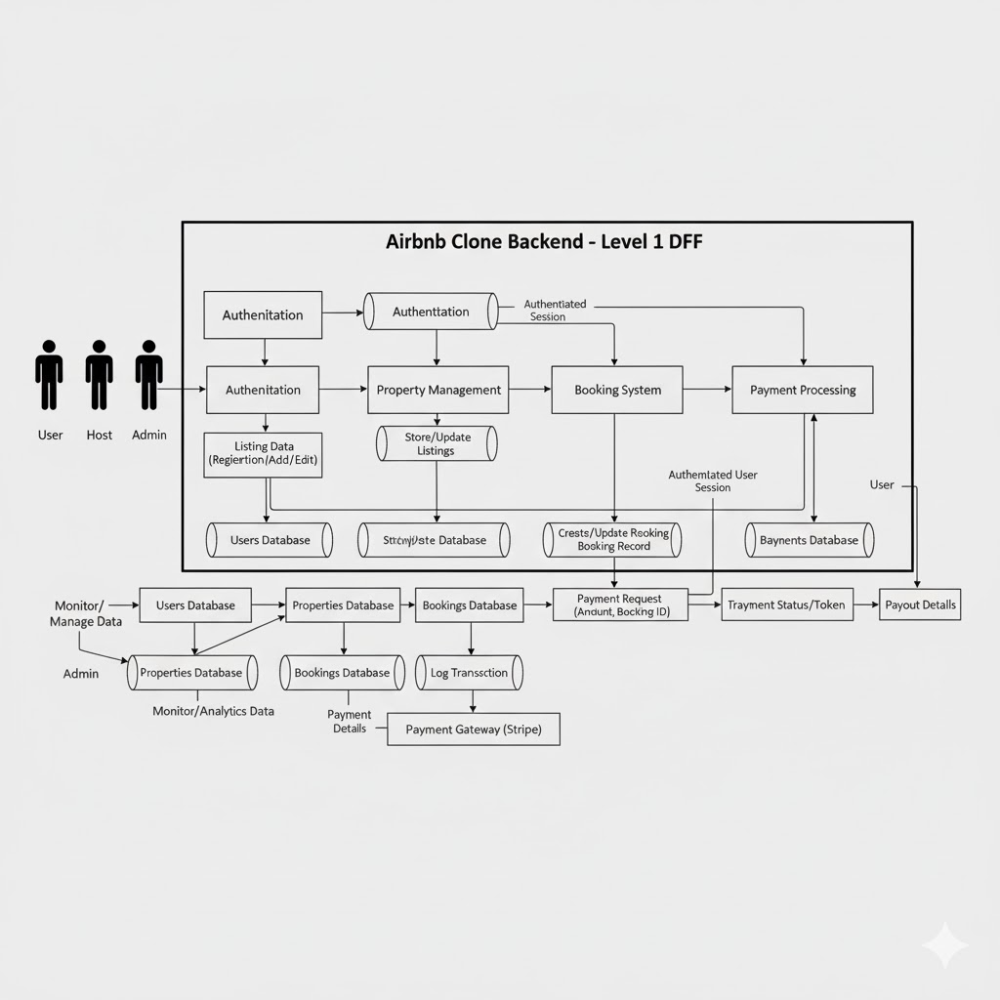

# Airbnb Clone Backend — Data Flow Diagram (DFD)

## Overview
This Data Flow Diagram (DFD) illustrates how data moves within the Airbnb Clone backend system.  
It captures the flow between external entities, backend processes, and data storage components.

---

## Key Entities
- **User** — Interacts with the system to search, book, and pay for properties.
- **Host** — Manages property listings and booking information.
- **Admin** — Oversees system data, reports, and user activities.
- **Payment Gateway (Stripe)** — Handles secure payment transactions.

---

## Main Processes
1. **Authentication** — Validates user credentials and manages sessions.
2. **Property Management** — Handles listing creation, updates, and deletion.
3. **Booking System** — Processes bookings and checks availability.
4. **Payment Processing** — Interacts with Stripe API for payments and refunds.

---

## Data Stores
- **Users DB**
- **Properties DB**
- **Bookings DB**
- **Payments DB**

---

## Data Flows
- User credentials → Authentication → Users DB  
- Booking details → Booking System → Bookings DB  
- Payment data → Payment Processing → Stripe API → Payments DB  
- Admin requests → Database → Reports

---

## Diagram

